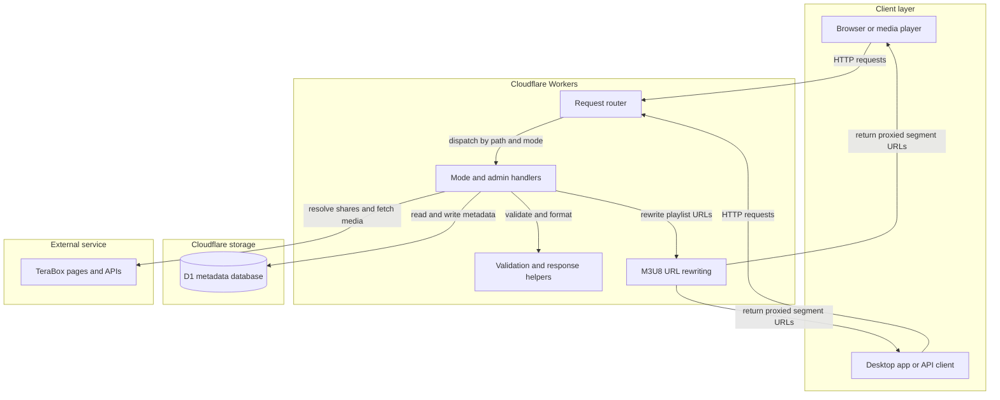
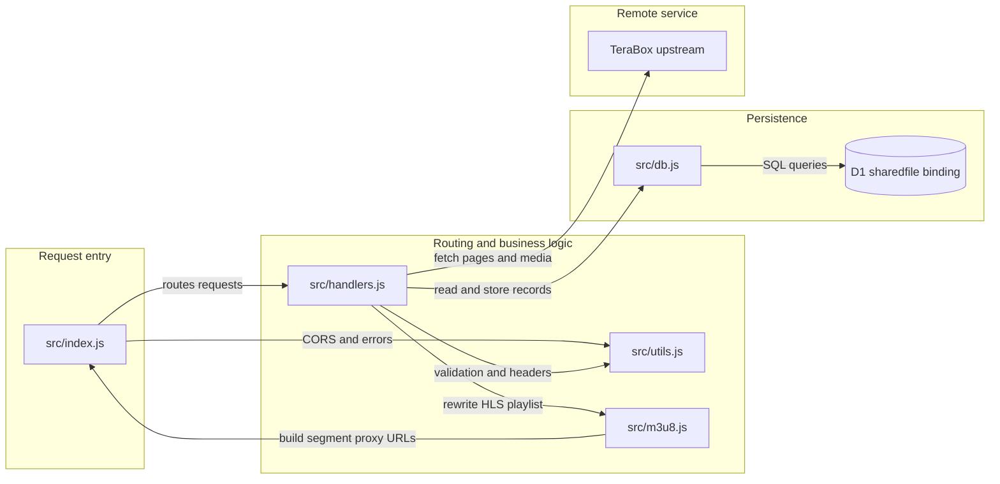

# TBX Proxy

> A Cloudflare Workers API for resolving TeraBox shares, caching file metadata in D1, and proxying video playlists, segments, and thumbnails.

[](https://workers.cloudflare.com/)
[](https://developer.mozilla.org/docs/Web/JavaScript/Guide/Modules)
[](https://developers.cloudflare.com/d1/)

TBX Proxy sits between clients and TeraBox. It retrieves share information from TeraBox, optionally caches metadata in Cloudflare D1, and can rewrite HLS playlists so video segments are requested through the Worker.

## Contents

- [Features](#features)
- [Architecture](#architecture)
- [Repository layout](#repository-layout)
- [Quick start](#quick-start)
- [Deploy to Cloudflare](#deploy-to-cloudflare)
- [API reference](#api-reference)
- [D1 data model](#d1-data-model)
- [Security and operations](#security-and-operations)
- [Troubleshooting](#troubleshooting)
- [License and disclaimer](#license-and-disclaimer)

## Features

- Resolve TeraBox share links and extract file metadata.
- Cache share, file, and thumbnail metadata in Cloudflare D1.
- Return a rewritten M3U8 playlist and proxy its media segments.
- Look up cached share and file records without contacting TeraBox.
- Proxy thumbnails and cache successful image responses at the edge.
- Provide protected admin endpoints for database inspection and analytics.
- Validate share identifiers, handle CORS preflight requests, and restrict segment proxying to TeraBox domains.

## Architecture

### Application architecture

<!-- mermaid-checked: no \n, no em-dash/en-dash, no {} in labels, subgraphs are id["label"], arrows are -->|"label"|, all subgraphs closed by end, ids unique -->


### Technology stack

| Layer | Technology | Version | Purpose |
|---|---|---|---|
| Runtime | Cloudflare Workers | Configured by Cloudflare | Runs the HTTP API at the edge |
| Language | JavaScript ES modules | No package version pinned | Request routing, upstream requests, and response transformation |
| Database | Cloudflare D1 | SQLite-compatible | Stores shares, files, and thumbnail metadata |
| Local development and deployment | Wrangler | Installed through `npx` | Runs the Worker locally and manages D1 and deployments |
| Upstream | TeraBox web pages and APIs | External service | Supplies share metadata, playlists, media segments, and thumbnails |

### Component relationships

<!-- mermaid-checked: no \n, no em-dash/en-dash, no {} in labels, subgraphs are id["label"], arrows are -->|"label"|, all subgraphs closed by end, ids unique -->


### Component inventory

| Component | Layer | Type | Responsibility |
|---|---|---|---|
| `src/index.js` | Entry | Worker request router | Handles CORS preflight, health checks, mode dispatch, admin authorization, and top-level errors |
| `src/handlers.js` | Application | Request handlers | Fetches TeraBox content, resolves shares, serves streams and thumbnails, queries D1, and implements admin routes |
| `src/utils.js` | Shared | Validation and HTTP helpers | Builds upstream URLs and headers, extracts tokens, validates share IDs, formats errors, and applies CORS |
| `src/db.js` | Data access | D1 query helpers | Saves and retrieves shares, file metadata, and thumbnail URLs |
| `src/m3u8.js` | Media | Playlist transformer | Rewrites media URLs to use the Worker segment proxy |
| `schema.sql` | Data definition | SQL schema | Creates D1 tables and lookup indexes |

### Data storage and external services

D1 stores metadata in `shares`, `media_files`, and `thumbnails`; TeraBox remains the source of truth for live share pages and media. Resolve responses use D1 when a cached record is available and fresh enough, otherwise the Worker requests TeraBox and updates the cache. The application also calls TeraBox for playlists, segments, and images. The Worker does not persist an inbound Cookie header as a secret; where supplied, request cookies are forwarded to upstream requests by the current implementation.

### Key architectural decisions

- The Worker is organized as a small router plus handler, persistence, HTTP utility, and playlist modules.
- D1 is an optional binding for some upstream routes, but lookup, thumbnail, and admin data operations require it.
- Segment proxy URLs are checked against an allowlist of TeraBox domains to reduce server-side request forgery (SSRF) risk.
- Resolve and stream metadata is considered stale after eight hours; thumbnail responses can be cached by clients and edge caches for a longer period.

## Repository layout

```text
.
├── schema.sql                 # D1 tables and indexes
├── wrangler.toml.example      # Configuration template (copy to wrangler.toml)
├── USAGE.md                   # Extended request examples
└── src/
    ├── index.js               # Worker entry point and router
    ├── handlers.js            # API, media, database, and admin handlers
    ├── db.js                  # D1 persistence helpers
    ├── utils.js               # HTTP, CORS, validation, and error helpers
    └── m3u8.js                # HLS playlist rewriting
```

## Quick start

### Requirements

- Node.js and npm
- A Cloudflare account with Workers and D1 enabled
- Wrangler CLI (commands below use `npx wrangler`)

### Configure a D1 database

The repository ignores `wrangler.toml` because it contains account-specific settings. First create a D1 database, then copy the template and bind it to that database:

```powershell
npx wrangler login
npx wrangler d1 create sharedfile
Copy-Item .\wrangler.toml.example .\wrangler.toml
```

Replace the placeholder `database_id` in `wrangler.toml` with the ID returned by Wrangler. Keep the binding name as `sharedfile`. Do not commit this account-specific file.

Initialize the local D1 database and start the Worker:

```powershell
npx wrangler d1 execute sharedfile --local --file=.\schema.sql
npx wrangler dev --local --port 8787
```

Check that it is running:

```powershell
curl.exe "http://localhost:8787/?mode=health"
```

Expected response:

```json
{"status":"ok","timestamp":"..."}
```

To initialize or update the **remote** D1 database instead, use `--remote`:

```powershell
npx wrangler d1 execute sharedfile --remote --file=.\schema.sql
```

## Deploy to Cloudflare

### 1. Prepare the account

Log in and confirm that your Cloudflare account email is verified:

```powershell
npx wrangler login
npx wrangler whoami
```

If this is the first Worker deployed to `workers.dev`, Wrangler may prompt to register a workers.dev subdomain. Enter the subdomain name only, without `https://`; names are unique and may already be taken.

### 2. Create or bind the remote D1 database

If you do not already have a database for this Worker:

```powershell
npx wrangler d1 create sharedfile
```

Set the returned database ID in `wrangler.toml`:

```toml
[[d1_databases]]
binding = "sharedfile"
database_name = "sharedfile"
database_id = "PASTE_THE_DATABASE_ID_FROM_WRANGLER"
```

Keep `binding = "sharedfile"` unchanged; the Worker reads D1 through `env.sharedfile`.

Apply the schema remotely:

```powershell
npx wrangler d1 execute sharedfile --remote --file=.\schema.sql
```

For an existing database, confirm that its ID in `wrangler.toml` belongs to the Cloudflare account currently selected by `wrangler whoami`.

### 3. Configure admin access (optional)

Admin routes return `401` unless `ADMIN_KEY` is configured. Set it as a Worker secret rather than committing it to source control:

```powershell
npx wrangler secret put ADMIN_KEY
```

### 4. Deploy and verify

```powershell
npx wrangler deploy
```

Test the deployed Worker:

```powershell
curl.exe "https://YOUR_WORKER.YOUR_SUBDOMAIN.workers.dev/?mode=health"
```

Use the resulting Worker URL as the API base URL in your client. Re-run `npx wrangler deploy` after code or configuration changes.

> **Deployment target:** This repository is a Cloudflare Worker and depends on the Workers runtime and D1 binding. It is not a direct Vercel deployment; moving it to Vercel would require replacing those platform-specific integrations.

## API reference

Requests are routed by the `mode` query parameter, except for the path-based `/admin/*` routes. The Worker responds to `OPTIONS` requests for CORS preflight.

| Mode or path | Required parameters | Returns | Description |
|---|---|---|---|
| `/?mode=health` | None | JSON | Returns `status: ok` and a timestamp |
| `/?mode=page&surl=...` | `surl` | HTML | Fetches a TeraBox share page |
| `/?mode=api&jsToken=...&shorturl=...` | `jsToken`, `shorturl` | JSON | Calls the TeraBox share-list API |
| `/?mode=resolve&surl=...` | `surl` | JSON | Resolves file metadata and uses D1 cache when available |
| `/?mode=lookup&surl=...` | `surl` or `fid` | JSON | Reads cached share or file metadata from D1 only |
| `/?mode=stream&surl=...` | `surl` | M3U8 | Returns a playlist with rewritten segment URLs |
| `/?mode=segment&url=...` | `url` | Media data | Proxies an allowlisted TeraBox segment and forwards supported range/conditional headers |
| `/?mode=thumbnail&fid=...` | `fid` | Image | Retrieves a cached thumbnail or refreshes share metadata |
| `/admin/overview` | Admin key | JSON | Returns D1 record counts and recently updated shares |
| `/admin/shares` | Admin key | JSON | Lists/searches shares with pagination |
| `/admin/shares/:share_id` | Admin key | JSON | Returns a share and its paginated files |
| `/admin/files` | Admin key | JSON | Lists/searches files with optional size and share filters |
| `/admin/files/:fs_id` | Admin key | JSON | Returns a file record and thumbnail URLs |
| `/admin/thumbnails` | Admin key | JSON | Lists thumbnail records with optional filters |
| `/admin/analytics/processed` | Admin key | JSON | Returns processing counts grouped by day |
| `/admin/kv/entry?surl=...` | Admin key and `surl` | JSON | Queries a resolved record by share URL |

### Resolve options

| Parameter | Values | Behavior |
|---|---|---|
| `refresh` | `1` | Bypasses the D1 cache and requests fresh metadata |
| `raw` | `1` | Returns the upstream or cached record instead of the summarized response |
| `domain` | Allowed TeraBox hostname | Prioritizes the requested host when it is in the upstream allowlist |

The segment proxy accepts TeraBox hosts and their subdomains, including `terabox.com`, `terabox.app`, `1024tera.com`, `1024terabox.com`, `freeterabox.com`, `teraboxcdn.com`, `dm.terabox.app`, `dm.1024tera.com`, `terasharelink.com`, `terafileshare.com`, `teraboxlink.com`, `teraboxshare.com`, `terasharefile.com`, and `teraboxurl.com`.

Example:

```powershell
$base = "https://YOUR_WORKER.YOUR_SUBDOMAIN.workers.dev"
curl.exe "$base/?mode=resolve&surl=YOUR_SHARE_ID"
curl.exe "$base/?mode=resolve&surl=YOUR_SHARE_ID&refresh=1"
curl.exe "$base/?mode=stream&surl=YOUR_SHARE_ID&type=M3U8_AUTO_360"
curl.exe "$base/?mode=lookup&surl=YOUR_SHARE_ID"
```

The regular resolve response includes a `source` value (`d1` or `live`) and a `data` object with fields such as `name`, `size`, `dlink`, `fid`, `shareid`, and `thumb`. In `raw=1` responses, cached results are in `data`, while live upstream results are in `upstream`. A `dlink` may require valid TeraBox cookies when used directly and may expire; resolve again to refresh it.

Call an admin endpoint by sending the key in a header:

```powershell
curl.exe -H "x-admin-key: YOUR_ADMIN_KEY" "$base/admin/overview"
```

### Error responses

Errors use a JSON body with an `error` message and a machine-readable `code`; some responses include `details` or `required`.

| HTTP status | Meaning |
|---|---|
| `400` | Invalid request, missing parameter, or malformed share/file ID |
| `401` | Admin key missing or incorrect |
| `403` | Token extraction failed or segment URL is outside the allowlist |
| `404` | Share, file, or cached entry not found |
| `500` | Incomplete metadata or internal processing/database error |
| `502` | TeraBox returned an upstream/network error or unexpected response |
| `503` | Required D1 binding is unavailable |
| `504` | Upstream request timed out |

For extended examples and sample responses, see [USAGE.md](USAGE.md).

## D1 data model

| Table | Contents | Main relationship |
|---|---|---|
| `shares` | Share ID, owner, title, upstream IDs, status, and last update time | One row per `share_id` |
| `media_files` | File IDs, names, paths, sizes, timestamps, and download links | Associated with a share by `share_id` |
| `thumbnails` | Image URL and thumbnail type | Associated with a file by `fs_id` |

`schema.sql` creates the tables and indexes on `media_files.share_id` and `thumbnails.fs_id`. Apply it to local D1 with `--local` and to Cloudflare D1 with `--remote`.

## Security and operations

- **Protect admin routes:** Set `ADMIN_KEY` as a Worker secret. Send it in the `x-admin-key` request header. Avoid query-string credentials because URLs are commonly recorded in logs and browser history.
- **Treat metadata as sensitive:** D1 records include share and file metadata, and may include signed download links. Restrict access to admin endpoints and avoid publishing private share URLs.
- **Do not expose account secrets:** Keep `wrangler.toml` out of version control and never commit `ADMIN_KEY` or personal TeraBox cookies.
- **Segment URL validation:** Segment proxy requests are restricted to the TeraBox host allowlist. Do not remove this check or accept arbitrary hostnames.
- **Cookie handling:** The Worker can forward an inbound `Cookie` header to TeraBox. It does not provide a built-in cookie vault; configure cookie ownership and handling in the client or upstream Gateway that calls this Worker.
- **CORS:** The Worker currently allows cross-origin requests from any origin. CORS is not authentication; use the admin key to protect admin routes.
- **Cache freshness:** Resolve and stream metadata uses an eight-hour freshness window. Signed links can expire independently; refresh metadata if an upstream link stops working.

## Troubleshooting

| Symptom | Likely cause | What to check |
|---|---|---|
| D1 says database could not be found (`7404`) | The configured ID is from another account or an old database | Run `npx wrangler whoami`; update `database_id` in `wrangler.toml` to the ID returned by `wrangler d1 create` for this account |
| `d1_unavailable` (`503`) | Missing or mismatched D1 binding | Confirm the binding is named `sharedfile` and points to a database, then redeploy |
| Admin routes return `401` | `ADMIN_KEY` is missing or incorrect | Set it with `npx wrangler secret put ADMIN_KEY` and send `x-admin-key` |
| Deploy reports email verification required (`10034`) | Cloudflare account email is not verified | Verify the email in Cloudflare Dashboard, then retry deployment |
| `workers.dev` subdomain is unavailable | The name is already registered or invalid | Choose an available name; provide the name alone, not a URL |
| Resolve or stream returns an upstream error | TeraBox changed behavior, the share is unavailable, or verification is required | Retry with `refresh=1`, check the share URL, and inspect Worker logs with `npx wrangler tail` |
| Local D1 query fails | Local schema has not been applied | Run `npx wrangler d1 execute sharedfile --local --file=.\schema.sql` |

View deployed logs with:

```powershell
npx wrangler tail
```

## License and disclaimer

The project declares the MIT License.

This proxy is provided for educational purposes. You are responsible for complying with TeraBox's Terms of Service, applicable laws, and any rights associated with content you access.
